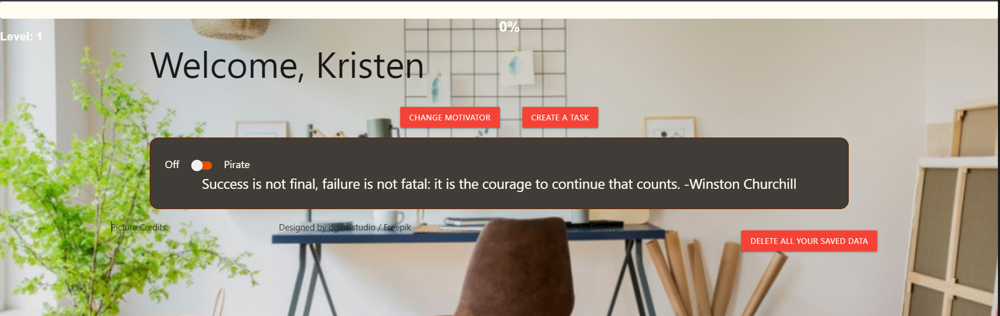

# PineappleMotivator
This application helps you stay focused on your ongoing projects and provides a motivation to complete the tasks by 'gamifying' the experience. 

## USER STORY
AS A user I need motivation
I WANT help tracking my projects and staying motivated
SO THAT I can complete my projects

## Acceptance Criteria
GIVEN I enter the site for the time
THEN I can enter my name and favorite thing
WHEN I have netered my name and favporite thing 
THEN I am greeted by the main page that has a motivational quote, toggle to pirate mode, option to create a task, my level/exp, and an option to change my motivation.
WHEN I click the pirate mode toggle
THEN my motivational quote and display turn pirate themed.
WHEN I create a task
THEN I am prompted with a modal to input my project name and difficulty
WHEN I try to create a task with the same name as another task
THEN I am given an error message and told to input a differnt project name
WHEN I submit this inpoformation
THEN a card is created on the main page with the information I put in, a representative motivational image related to the project difficulty, a create subtasks button, a notes section, a save changes button, and a delete project button.
WHEN i click on create a subtask
THEN it creates a checkbox and text area for me to write what the subtask is and check it off upon completion
WHEN I click save changes
THEN everything is saved to local storage so that if I close the page and reopen it my information will still be there
WHEN I delete a task
THEN the project card will disappear and it will not affect my level/exp
WHEN I complete a task
THEN I see my exp bar fill up based on the difficulty level of the task
WHEN my exp bar fills up
THEN a modal appears with a button to bring up YouTube videos related to my motivation that I can choose from.
WHEN I click on a YouTube video
THEN it opens the video in another tab

## Installation
there is no installation necessary and our applicatioin can be accessed from any web browser at this URL: [insert url here]

## Usage 
If it is the first time loading the page or you clear your local storage then you will immediately be prompted to input your name and a motivational item (i.e. cats, dogs, etc.).  

When you submit this information, you are taken to the main page that has a number of different features. At the top of the page, there is a level and exp bar. The exp bar indicates how close you are to rewarding yourself with a YouTube video (which happens on level up) as well as a level indiccating your progress on consistently completing tasks using the application. There is a button that gives the user an option to change their motviation if they get tired of their original input. There is a motivational quote loaded to the page with a pirate toggle right next to it.  If the pirate toggle is flipped then the page transforms the color scheme and style to a nautical pirate theme and translates the motivational quote into 'pirate.' The create task button brings up a modal to put in all of your project information. The name of the project cannot match anopther active project withi the sight or you will get an error message within the modal saying that you must have a project name that does not match another. Additionally, you will be prompted to select the difficulty of the task and the exp earned for the task will depend on the difficulty as you should be rewarded more for a more difficult task. When you hit submit, a project card will be created. ON this project card you will see the name and difficulty that you had just put in. as well as some other content. At the top there is a complete project button which will mark the project as complete and delete the card and award you the exp for completing the task. There is a graphic relating to the difficulty of the project. There is a button to create subtasks which creates a checkbox and text area for you to use to break down you project into smaller sections. There is a notes section to keep track of any notes about the projevct that you may want. There is a save changes button which saves any changes you make to this card; if you do not hit this button your changes will not be saved upon refresh/reload. There is also a delet button for you to delete the project; this works like the complete project button except that it does not award the exp as you are not completing the task. 